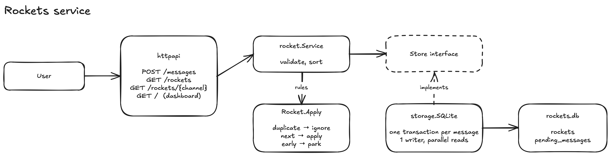

# Rockets service

Consumes rocket messages and serves each rocket's current state over a REST API.

## Run

Requires Go 1.25+.

```bash
make run
./rockets launch "http://localhost:8088/messages" # run from the folder with the rockets executable
```

Dashboard: http://localhost:8088/

Pass flags with `ARGS`, e.g. `make run ARGS="-addr :9090 -reset"`:

| Flag     | Default      | Description                              |
| -------- | ------------ | ---------------------------------------- |
| `-addr`  | `:8088`      | Address to listen on.                    |
| `-db`    | `rockets.db` | SQLite database file.                    |
| `-reset` | `false`      | Delete all stored state before starting. |

Docker:

```bash
docker build -t rockets-service .
docker run -p 8088:8088 -v rockets-data:/data rockets-service
```

Tests:

```bash
make test
```

## API

| Endpoint                 | Description                                                                                                                              |
| ------------------------ | ---------------------------------------------------------------------------------------------------------------------------------------- |
| `POST /messages`         | Ingest a message. `202` on success.                                                                                                       |
| `GET /rockets`           | All rockets. `sort` = `channel` (default), `type`, `mission`, `speed`, `status`, `lastMessageNumber`, `pendingMessages`; `order` = `asc` (default), `desc`. |
| `GET /rockets/{channel}` | One rocket, or `404`.                                                                                                                    |

`POST /messages` takes one message per request:

```json
{
  "metadata": {
    "channel": "193270a9-c9cf-404a-8f83-838e71d9ae67",
    "messageNumber": 1,
    "messageTime": "2022-02-02T19:39:05.86337+01:00",
    "messageType": "RocketLaunched"
  },
  "message": { "type": "Falcon-9", "launchSpeed": 500, "mission": "ARTEMIS" }
}
```

| `messageType`          | `message`                                                 |
| ---------------------- | --------------------------------------------------------- |
| `RocketLaunched`       | `{"type": "Falcon-9", "launchSpeed": 500, "mission": "ARTEMIS"}` |
| `RocketSpeedIncreased` | `{"by": 3000}`                                            |
| `RocketSpeedDecreased` | `{"by": 2500}`                                            |
| `RocketExploded`       | `{"reason": "PRESSURE_VESSEL_FAILURE"}`                   |
| `RocketMissionChanged` | `{"newMission": "SHUTTLE_MIR"}`                           |

`GET /rockets/{channel}` returns one rocket; `GET /rockets` returns an array of them:

```bash
curl "http://localhost:8088/rockets/193270a9-c9cf-404a-8f83-838e71d9ae67"
```

```jsonc
{
  "channel": "193270a9-c9cf-404a-8f83-838e71d9ae67",
  "status": "launched", // awaiting_launch, launched or exploded (then also "explosionReason")
  "type": "Falcon-9",
  "mission": "ARTEMIS",
  "speed": 500,
  "lastMessageNumber": 1,
  "lastMessageTime": "2022-02-02T19:39:05.86337+01:00",
  "pendingMessages": 0 // messages that arrived early and wait for an earlier one; stuck above 0 = stalled
}
```

```bash
curl "http://localhost:8088/rockets?sort=speed&order=desc"
```

## Design

The service separates message processing rules from HTTP handling and storage. The domain defines how messages change rocket state, while SQLite provides durable and atomic processing. Duplicate and out-of-order messages are handled while preserving per-rocket ordering.




The implementation is split into three main layers:

- **HTTP (`internal/httpapi`)** — exposes the service over HTTP, handles JSON requests and responses, and serves a small dashboard.
- **Domain (`internal/rocket`)** — defines rockets, messages, validation, and the rules for applying events. It contains no persistence or HTTP concerns.
- **Storage (`internal/storage`)** — provides durable SQLite persistence for rocket state and out-of-order messages. Processing a message and updating the resulting state happens atomically within a transaction.

### Persistence and failure handling

The sender retries messages until they are acknowledged, so the service persists accepted messages before returning `202`. SQLite stores both the current rocket state (`rockets` table) and messages waiting for an earlier message to arrive (`pending_messages` table).

Message processing is transactional: either the complete state transition (rocket state is updated, applied pending messages are removed) is committed or none of it is. If the service crashes before committing, the sender can safely retry the message.

### Concurrency

SQLite allows only one writer at a time. So writes are serialized by the database, while WAL mode allows reads to proceed concurrently with a writer.

### Message processing

For each incoming message, the service determines whether it has already been processed, can be applied immediately, or needs to wait for an earlier message.

When a message is applied, the service also checks whether it unlocks any consecutive pending messages and applies those in the same transaction. As a result, duplicate delivery, out-of-order delivery, and crashes do not change the eventual rocket state.

## Testing

`make test` runs tests for each layer:

- `internal/rocket`: the ordering rules and message decoding with plain values; the service
  with a mocked `Store`. No database.
- `internal/storage`: the SQLite store against a real database file: gaps filled later,
  repeats, restarts, concurrent shuffled and duplicated messages, closed-database errors.
- `internal/httpapi`: the HTTP API through the real service and SQLite (status codes,
  sorting, error responses, dashboard).

GitHub Actions runs two jobs on every push and pull request:

- `test`: `go vet` and `go test -race ./...`;
- `smoke`: builds and starts the server, posts messages out of order and with a repeat, then
  checks the results with `curl` and `jq`: the rocket's final state, sorting, `404` for an
  unknown rocket and `400` for a malformed message.

## Trade-offs

- **Current state over event sourcing.** Only rocket state and pending messages are persisted. This keeps the design simple, but provides no history or replay.
- **SQLite over an external database.** Durable and transactional with no extra infrastructure, but limited to one writer at a time. WAL mode allows concurrent reads.
- **Domain logic separated from storage.** Rules live in `Rocket.Apply`; storage provides persistence and atomicity.
- **Simple reads over pagination.** Rockets are loaded and sorted in memory, which is sufficient for the expected scale.
- **Strict ordering.** A missing message blocks later messages for that rocket; the service relies on the sender's at-least-once delivery guarantee.

Authentication, metrics, and rate limiting are out of scope.

## Scaling

Rockets are independent, so different rockets can be processed concurrently.

- **Writes.** SQLite's single writer is the main bottleneck. At higher load, switch to Postgres and multiple service instances, with row-level locking per rocket.
- **Reads.** Move sorting and pagination into the database and add appropriate indexes as the dataset grows.
- **Pending messages.** A stalled rocket can accumulate an unbounded backlog. Monitor its size and age and define a recovery policy.

## How I used AI

I used Claude Code to assist with implementation. I defined the architecture, behavior, and key design decisions, and reviewed and adapted generated code before including it.

The dashboard UI was generated largely by AI by design, as it is an optional convenience around the core implementation rather than part of the challenge itself. AI also helped generate the GitHub Actions workflow and some tests.
